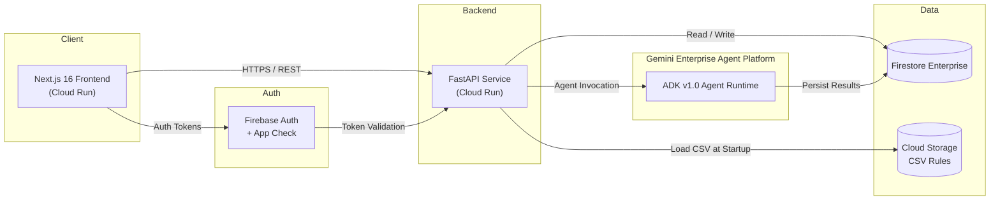
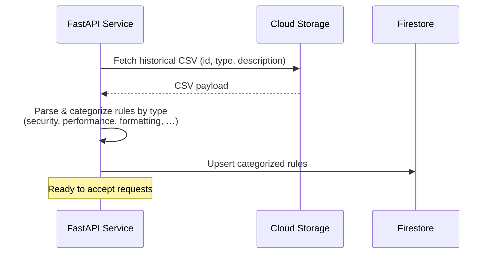
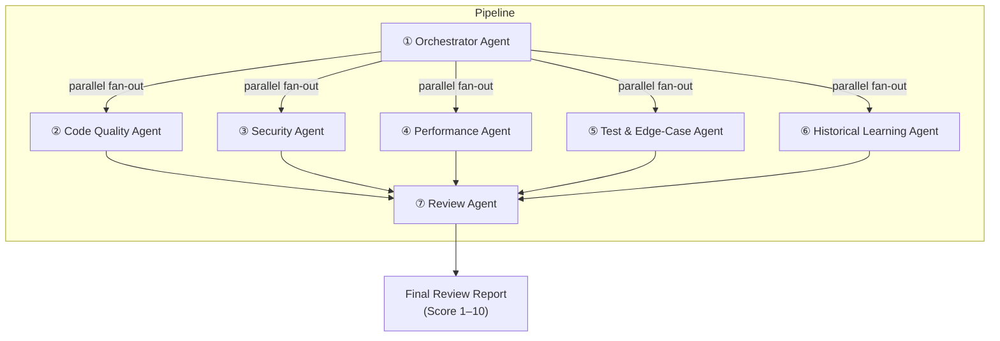
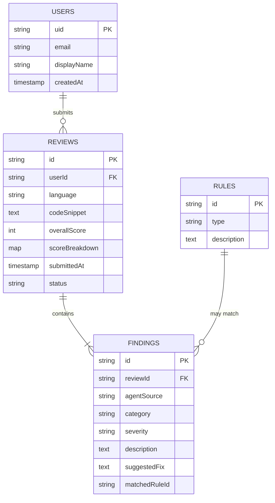
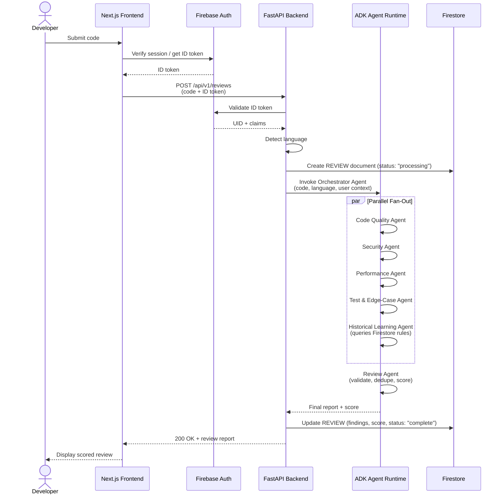
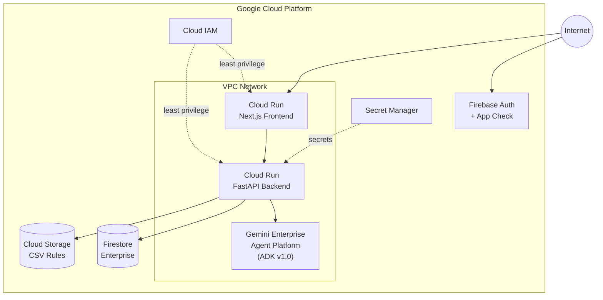

# Architecture — Multi-Agent AI Code Reviewer

> **Version:** 1.0  
> **Last Updated:** 2026-08-18  
> **Status:** Design

---

## 1. System Overview

The Multi-Agent AI Code Reviewer is a serverless, cloud-native platform that automatically reviews code submissions using seven specialized AI agents. Authenticated users submit code through a web frontend; the platform detects the programming language, fans the code out to specialist agents in parallel, consolidates findings into a scored report (1–10), and persists every review for historical learning.

### Design Principles

| Principle | Description |
|---|---|
| **Specialist Decomposition** | Each review concern (quality, security, performance, testing, history) is owned by a dedicated agent. |
| **Orchestrated Parallelism** | The Orchestrator fans out work to all specialists simultaneously, then merges results. |
| **Explainability** | Every finding is grounded in the submitted code and scored with a clear rationale. |
| **Historical Grounding** | Reviews are enriched with team-specific patterns from ingested CSV rule data. |
| **Human-in-the-Loop** | The system advises — it never auto-approves or auto-merges code. |

---

## 2. High-Level Architecture

---

## 3. Component Architecture

### 3.1 Presentation Layer — Next.js 16 Frontend

| Aspect | Detail |
|---|---|
| **Framework** | Next.js 16 (React, server components) |
| **Hosting** | Cloud Run (containerized) |
| **Auth** | Firebase Authentication SDK with App Check |
| **Responsibilities** | Code submission form, review result display, review history & growth tracking dashboard |

**Key Pages / Routes:**

| Route | Purpose |
|---|---|
| `/login`, `/register` | User authentication flows |
| `/submit` | Code submission (paste or file upload) |
| `/reviews/:id` | Single review report with score breakdown |
| `/history` | Chronological review history with quality-score trend |

---

### 3.2 API Layer — FastAPI Backend

| Aspect | Detail |
|---|---|
| **Framework** | FastAPI (Python) |
| **Hosting** | Cloud Run (serverless, auto-scaling) |
| **Auth** | Validates Firebase ID tokens on every request |
| **Responsibilities** | Request validation, language detection, agent pipeline orchestration, persistence, CSV rule ingestion |

**Core Endpoints:**

| Method | Path | Description |
|---|---|---|
| `POST` | `/api/v1/reviews` | Submit code for review |
| `GET` | `/api/v1/reviews/{id}` | Retrieve a single review report |
| `GET` | `/api/v1/reviews` | List authenticated user's review history |
| `GET` | `/api/v1/health` | Service health check |

**Startup Sequence:**

---

### 3.3 Agent Layer — ADK v1.0 on Gemini Enterprise Agent Platform

All agents run on the **Gemini Enterprise Agent Platform** using the **Agent Development Kit (ADK) v1.0** and are powered by **Gemini 3.6 Flash**.

#### Agent Inventory

#### Agent Specifications

| # | Agent | Model | Input | Output |
|---|---|---|---|---|
| 1 | **Orchestrator** | Gemini 3.6 Flash | PR diff, metadata, detected language | Review plan; delegates to specialists; computes overall score |
| 2 | **Code Quality** | Gemini 3.6 Flash | Diff, coding guidelines, linter output | Readability, maintainability, refactoring findings |
| 3 | **Security** | Gemini 3.6 Flash | Diff, auth logic, API routes, env config | Vulnerabilities, access-control gaps, data-exposure risks |
| 4 | **Performance** | Gemini 3.6 Flash | DB queries, API code, data-volume assumptions | Scalability issues, N+1 queries, missing pagination |
| 5 | **Test & Edge-Case** | Gemini 3.6 Flash | Test files, API spec, diff | Missing test scenarios, assertion quality |
| 6 | **Historical Learning** | Gemini 3.6 Flash | Current diff + Firestore rules (by type) | Pattern matches from CSV rule base, past PR parallels |
| 7 | **Review** | Gemini 3.6 Flash | Combined specialist outputs | Deduplicated, prioritized, scored final report |

---

## 4. Data Architecture

### 4.1 Firestore Enterprise — Collections

### 4.2 Cloud Storage — Historical CSV

| Bucket Path | Purpose |
|---|---|
| `gs://<project>/rules/historical_reviews.csv` | Source-of-truth CSV with schema `id, type, description` |

The CSV is loaded at service startup, parsed into typed rule objects, and upserted into the `RULES` Firestore collection. During a review, the Historical Learning Agent queries rules by `type` and injects matched rules into specialist agent prompts.

---

## 5. Request Lifecycle — End-to-End Flow

---

## 6. Security Architecture

### 6.1 Authentication & Authorization

| Layer | Mechanism |
|---|---|
| **Identity** | Firebase Authentication (email/password; extensible to OAuth) |
| **Abuse Prevention** | Firebase App Check — blocks unauthenticated and bot traffic |
| **API Auth** | Every backend request validated against Firebase ID token |
| **Per-User Isolation** | Firestore security rules + backend checks: users access only their own data |

### 6.2 Network & Infrastructure

| Control | Implementation |
|---|---|
| **Transport** | HTTPS / TLS everywhere |
| **IAM** | Google Cloud IAM — least-privilege service accounts for Cloud Run, Firestore, Cloud Storage |
| **VPC** | Backend services deployed within a VPC for network isolation |
| **Secrets** | No secrets in code — managed via Google Secret Manager or environment variables |

### 6.3 Data Protection

- Submitted code is stored encrypted at rest in Firestore (Google-managed encryption).
- No raw customer data is logged — the Security Agent itself enforces PII-awareness in reviews.
- CSV rule data in Cloud Storage is access-controlled via IAM.

---

## 7. Scoring Model

The Orchestrator computes an **overall quality score (1–10)** by aggregating dimension scores from each specialist agent.

### Dimension Breakdown

| Dimension | Agent Source | Weight |
|---|---|---|
| Security | Security Agent | High |
| Performance | Performance Agent | Medium–High |
| Code Quality | Code Quality Agent | Medium |
| Test Coverage | Test & Edge-Case Agent | Medium |
| Historical Patterns | Historical Learning Agent | Low–Medium |

### Score Interpretation

| Score Range | Label | Recommendation |
|---|---|---|
| **9–10** | Excellent | Production-ready, no significant issues |
| **7–8** | Good | Minor suggestions, safe to merge |
| **5–6** | Fair | Notable issues to address before merging |
| **3–4** | Poor | Significant bugs, security, or design problems |
| **1–2** | Critical | Fundamental flaws, do not merge |

---

## 8. Infrastructure Topology

### Deployment Characteristics

| Property | Detail |
|---|---|
| **Compute** | Fully serverless — Cloud Run auto-scales to zero |
| **Scaling** | Request-based autoscaling; agent calls parallelized |
| **Cold Start** | CSV rule ingestion occurs on container startup |
| **Observability** | Cloud Logging, Cloud Trace, Cloud Monitoring |
| **CI/CD** | Container images built and deployed via Cloud Build (recommended) |

---

## 9. Multi-Language Support

| Capability | Detail |
|---|---|
| **Detection** | The Orchestrator Agent auto-detects the programming language from the submitted code |
| **Language-Aware Analysis** | Specialist agents apply language-specific linting rules, idioms, and best practices |
| **Multi-Language Reports** | Findings reference the correct language conventions (e.g., Python PEP 8, JavaScript ESLint rules) |

---

## 10. Technology Summary

| Layer | Technology |
|---|---|
| Frontend | Next.js 16, React |
| Backend API | FastAPI (Python) |
| Authentication | Firebase Auth + App Check |
| Database | Firestore Enterprise |
| Object Storage | Cloud Storage |
| AI Agents | ADK v1.0, Gemini 3.6 Flash |
| Agent Platform | Gemini Enterprise Agent Platform |
| Infrastructure | Google Cloud Run (serverless) |
| Networking | VPC, IAM, HTTPS/TLS |
| Secrets | Google Secret Manager |
