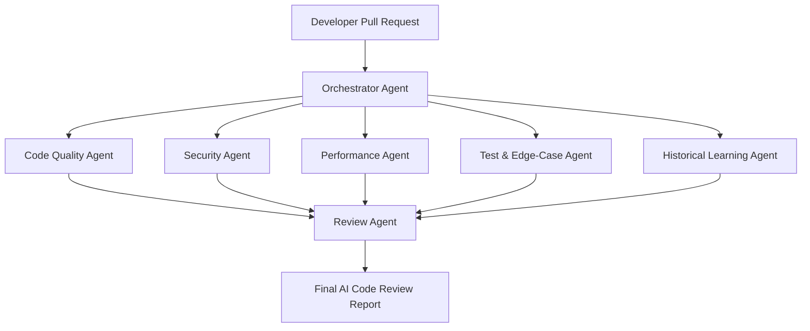

# Multi-Agent AI Code Reviewer

## Problem Statement — Automations & Multi-Agent Systems

---

## Background

Modern software teams move quickly, but code review often becomes a bottleneck. Developers may open pull requests with hundreds of lines of changes, and reviewers must check code quality, bugs, security risks, performance concerns, test coverage, and adherence to team conventions.

A developer may submit a pull request like:

> "Added a new customer-data API endpoint, updated the database query, and created unit tests."

To review it properly, a team needs to answer several questions:

- Does the code introduce bugs or edge cases?
- Does it follow the project's existing patterns and coding standards?
- Is customer data handled securely?
- Could the database query become slow at scale?
- Are the tests meaningful and sufficient?
- Has the team encountered a similar issue in previous pull requests?

A single reviewer may not have enough time or specialist knowledge to check every area deeply. This can lead to **delayed releases**, **inconsistent reviews**, **missed defects**, and **repeated technical debt**.

---

## Objective

Design a simple **Multi-Agent AI Code Reviewer** that automatically reviews a code change or pull request using multiple specialized AI agents. The system must let **authenticated users** securely submit source code and receive **comprehensive, multi-language** bug reports, architectural best-practice guidance, and optimization insights in return.

> **Key principle:** The goal is _not_ to replace human developers or approve code automatically. The goal is to show how specialized AI agents can analyze different aspects of a code change, collaborate through an orchestrator, and provide developers with **structured, useful, and explainable** review feedback.

### Feature Focus

**Multi-language Reviews, Quality Rating & Historical Learning**

---

## Real-World Problem to Solve

### "24/7 Intelligent Code Reviewer"

A developer submits a pull request or code snippet such as:

> "Add a Python API endpoint that returns customer order history. It includes a database query and basic unit tests."

The system should produce:

| Output Category                  | Description                                                    |
| -------------------------------- | -------------------------------------------------------------- |
| **Code-Review Summary**          | High-level overview of the pull request and its changes        |
| **Bugs & Edge Cases**            | Potential bugs and unhandled edge cases                        |
| **Code Quality**                 | Maintainability, readability, and refactoring suggestions      |
| **Security & Privacy Warnings**  | Vulnerabilities, access-control gaps, and data-exposure risks  |
| **Performance Concerns**         | Database efficiency, scalability, and runtime bottlenecks      |
| **Test-Coverage Recommendations**| Missing test scenarios and assertion quality                   |
| **Quality Score (1–10)**         | Standardized numeric code-quality rating on a scale of 1 to 10 with clear explanations |
| **Suggested Fixes**              | Actionable review comments for the developer                   |

The output should help a human reviewer make a **faster, more informed decision**.

---

## Platform Requirements

### User Authentication & Secure Submission

The platform must let **authenticated users** securely submit source code for review:

- **User registration and login** — users create accounts and authenticate before submitting code
- **Secure code submission** — all submissions go through authenticated API endpoints
- **Per-user access control** — users can only view their own submissions and review results

### Multi-Language Support

The system must support **multi-language code reviews**, not just Python:

- **Language detection** — automatically identify the programming language of the submitted code
- **Language-aware analysis** — apply language-specific linting rules, idioms, and best practices
- **Multi-language bug reports** — generate review findings that reference the correct language conventions

### Persistent Session History

The platform must maintain a **robust, persistent session history** for every user:

- **Review history storage** — every submission and its corresponding AI review are persisted in a database
- **Growth tracking** — users can view their review history over time to see how their code quality evolves
- **Optimization patterns** — recurring issues and improvements are surfaced so users can track development growth

### Standardized Quality Rating (1–10)

The core evaluation engine must analyze each submission and generate a **standardized code-quality rating on a scale of 1 to 10**:

| Score Range | Meaning |
|---|---|
| **9–10** | Excellent — production-ready, no significant issues |
| **7–8** | Good — minor suggestions, safe to merge |
| **5–6** | Fair — notable issues to address before merging |
| **3–4** | Poor — significant bugs, security, or design problems |
| **1–2** | Critical — fundamental flaws, do not merge |

---

## Multi-Agent System Design

The system comprises **7 agents**, each with a distinct responsibility:

| # | Agent                      | Primary Responsibility                                      |
|---|----------------------------|-------------------------------------------------------------|
| 1 | Orchestrator Agent         | Plan, delegate, combine findings, produce final report      |
| 2 | Code Quality Agent         | Structure, readability, maintainability, conventions        |
| 3 | Security Agent             | Security, privacy, and access-control risks                 |
| 4 | Performance Agent          | Scalability, database efficiency, runtime bottlenecks       |
| 5 | Test & Edge-Case Agent     | Test coverage, missing scenarios, assertion quality          |
| 6 | Historical Learning Agent  | Repository-specific patterns from past PRs and CSV data     |
| 7 | Review Agent               | Validate, deduplicate, prioritize, and finalize the report  |

---

### 1. Orchestrator Agent

**Role:** Creates the review plan, sends the code to the right specialist agents, combines their findings, and produces the final review report.

**What it does:**

- Reads the pull request title, description, changed files, and code diff
- **Detects the programming language** and selects the appropriate language-specific rules
- Extracts relevant context (API changes, database queries, authentication logic, test files)
- Delegates code analysis to specialist agents
- Resolves duplicate or conflicting findings
- Prioritizes issues by severity
- Synthesizes the final developer-friendly review
- Computes the **overall quality score (1–10)**

**Example output:**

> - "This pull request adds a customer-order API endpoint."
> - "The review found one high-priority security concern, two performance risks, and one missing test case."
> - "Recommended action: resolve authorization validation before merging."

---

### 2. Code Quality Agent

**Role:** Reviews code structure, readability, maintainability, and adherence to project conventions.

**Possible inputs:**

- Pull request diff
- Repository coding guidelines
- Existing project files
- Linter or static-analysis results
- Past accepted pull-request patterns

**What it does:**

- Detects duplicated or overly complex code
- Flags unclear naming, large functions, and poor separation of concerns
- Checks whether the code follows common project patterns
- Suggests refactoring opportunities
- Identifies potentially difficult-to-maintain logic

**Example output:**

> - "The API handler contains validation, database access, and response formatting in one function."
> - "Consider moving database logic into a service or repository layer."
> - "The variable name `data` is too broad; use `customer_orders` for clarity."

---

### 3. Security Agent

**Role:** Identifies security, privacy, and access-control risks in the code change.

**Possible inputs:**

- Source-code diff
- Authentication and authorization logic
- API route definitions
- Environment configuration
- Security rules and known vulnerability patterns

**What it does:**

- Checks for missing authentication or authorization
- Detects possible SQL injection, insecure input handling, or exposed secrets
- Flags logging of sensitive customer information
- Reviews whether users can access data belonging to other users
- Identifies unsafe error messages or insecure API behavior

**Example output:**

> - "**High risk:** the endpoint accepts a customer ID but does not verify that the authenticated user owns that customer record."
> - "Avoid returning raw database errors to the client."
> - "Do not log full customer records, as they may contain personally identifiable information."

---

### 4. Performance Agent

**Role:** Reviews the code for scalability, database efficiency, and possible runtime bottlenecks.

**Possible inputs:**

- Database queries
- API endpoint code
- Query-execution plans (if available)
- Existing performance guidelines
- Expected data volume or traffic assumptions

**What it does:**

- Detects inefficient database queries
- Identifies missing pagination for large datasets
- Flags repeated queries inside loops (N+1 problem)
- Checks for missing indexes or expensive joins
- Suggests caching or batching where appropriate

**Example output:**

> - "The endpoint returns all order history without pagination, which may become slow for long-term customers."
> - "The query appears to fetch customer details repeatedly inside a loop."
> - "Consider adding pagination with `limit` and `offset`, or cursor-based pagination."

---

### 5. Test & Edge-Case Agent

**Role:** Checks whether the pull request has enough automated tests and considers scenarios the developer may have missed.

**Possible inputs:**

- Unit-test files
- Integration-test files
- API contract or endpoint specification
- Code diff
- Existing test patterns in the repository

**What it does:**

- Identifies whether key code paths have tests
- Suggests missing positive, negative, and edge-case test scenarios
- Checks for authorization, invalid input, empty data, and error-handling tests
- Reviews whether assertions meaningfully validate behavior
- Recommends integration tests when an API, database, or external service is involved

**Example output:**

> - "Current tests cover a successful response but do not test unauthorized access."
> - "Add tests for an invalid customer ID, no orders found, database failure, and pagination."
> - "Test that one user cannot request another user's order history."

---

### 6. Historical Learning Agent

**Role:** Uses previous pull requests, bug reports, accepted review comments, and **ingested historical CSV data** to provide repository-specific feedback.

**Possible inputs:**

- Past pull requests
- Previous code-review comments
- Production bug reports
- Internal engineering guidelines
- Resolved security or performance incidents
- **Historical review CSV** with schema: `<id>, <type>, <description>`

**CSV data format:**

```csv
id, type,        description
1,  formatting,  Avoid single-character variable names — they hurt readability
2,  performance, Cache repeated database lookups inside the request loop
3,  security,    Never interpolate raw user input directly into SQL queries
```

**What it does:**

- **Parses and indexes the historical CSV** to build a searchable rule base
- Finds similar code changes from the repository history
- Identifies repeated defect patterns
- Retrieves relevant past review feedback
- **Matches current code against historical rules** by type (formatting, performance, security, etc.)
- Highlights whether the current change repeats a previously known issue
- Makes the review more specific to the team's codebase rather than generic

**Example output:**

> - "Historical rule #3 (security): Never interpolate raw user input directly into SQL queries — this code concatenates user input into a query string."
> - "A similar endpoint previously caused an authorization issue because ownership validation was missing."
> - "The team's past reviews recommend cursor pagination for order-history APIs."
> - "This query pattern is similar to a previous production performance incident."

---

### 7. Review Agent

**Role:** Validates and prioritizes the combined findings before the review is shown to the developer.

**What it checks:**

- Are the findings grounded in the submitted code?
- Are duplicate findings merged together?
- Is each issue assigned an appropriate severity level?
- Are suggestions actionable and understandable?
- Are critical security issues highlighted first?
- Does the final review separate blocking issues from optional improvements?
- Is the **1–10 quality score** consistent with the findings and explained clearly?
- Were relevant **historical rules** applied and cited?

> This agent acts as the **final quality checker** before the review is delivered.

---

## Expected Workflow



---

## Example Final Output

**Pull Request:** Add customer order-history API
**Language Detected:** Python
**Overall Quality Score:** **4 / 10** — Poor (significant security and design issues)

| Category                 | Finding                                                                                                           | Severity    |
| ------------------------ | ----------------------------------------------------------------------------------------------------------------- | ----------- |
| **Blocking Issue**       | The API endpoint must verify that the authenticated user is authorized to access the requested customer's orders. | 🔴 Critical |
| **Performance**          | Add pagination — returning unlimited order history may create slow responses for large accounts.                  | 🟠 High     |
| **Historical Rule**      | Rule #3 matched — raw user input is interpolated into a SQL query; use parameterized queries.                     | 🟠 High     |
| **Testing**              | Add tests for unauthorized access, invalid customer IDs, empty order history, and pagination behavior.            | 🟡 Medium   |
| **Code Quality**         | Separate request validation, database logic, and response formatting into smaller functions or layers.            | 🟢 Low      |

**Score Breakdown:**

| Dimension      | Score | Notes |
|----------------|-------|-------|
| Security       | 2/10  | Missing authorization check; SQL injection risk |
| Performance    | 4/10  | No pagination; potential N+1 queries |
| Code Quality   | 5/10  | Monolithic handler; unclear naming |
| Test Coverage  | 4/10  | Only happy-path tests present |
| Historical     | 5/10  | Matches 1 known anti-pattern from CSV rules |
