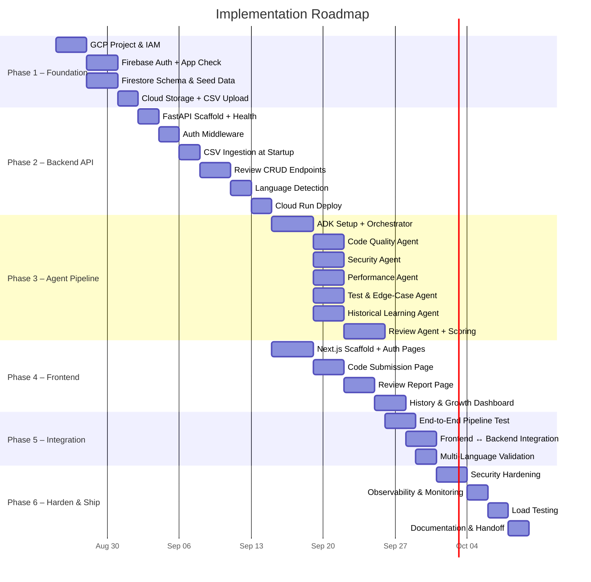
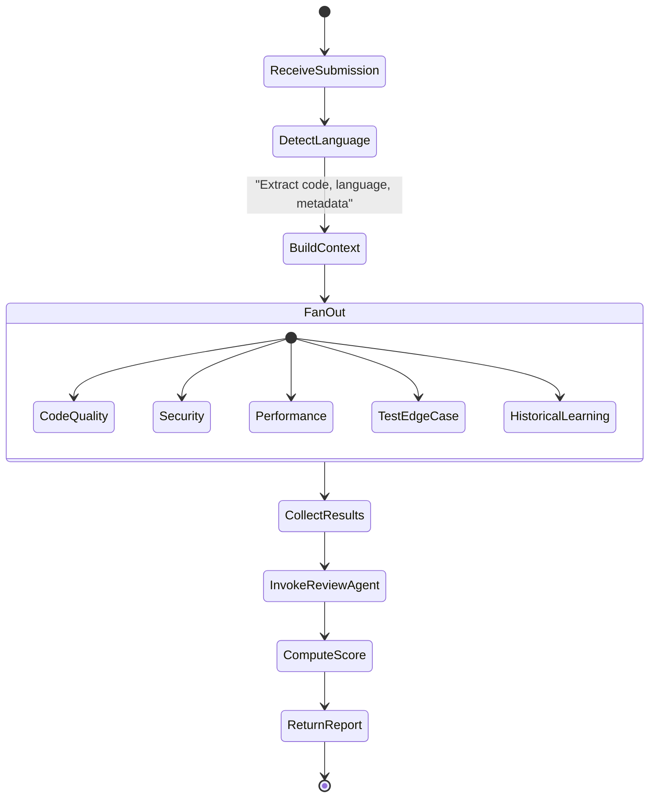
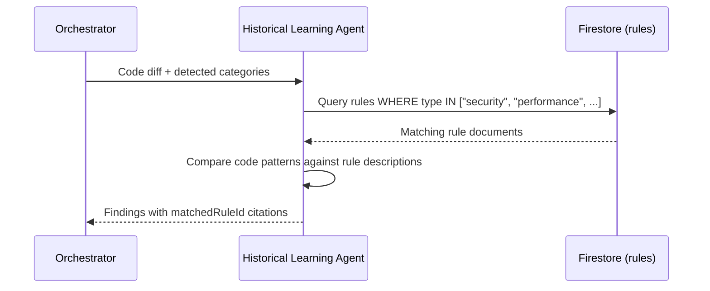
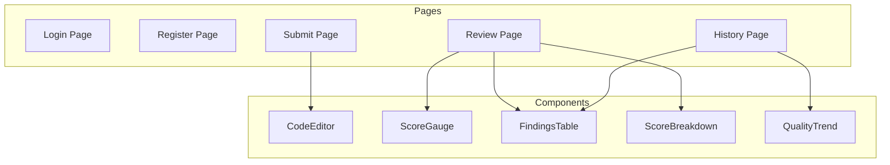
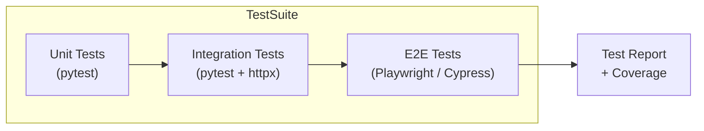
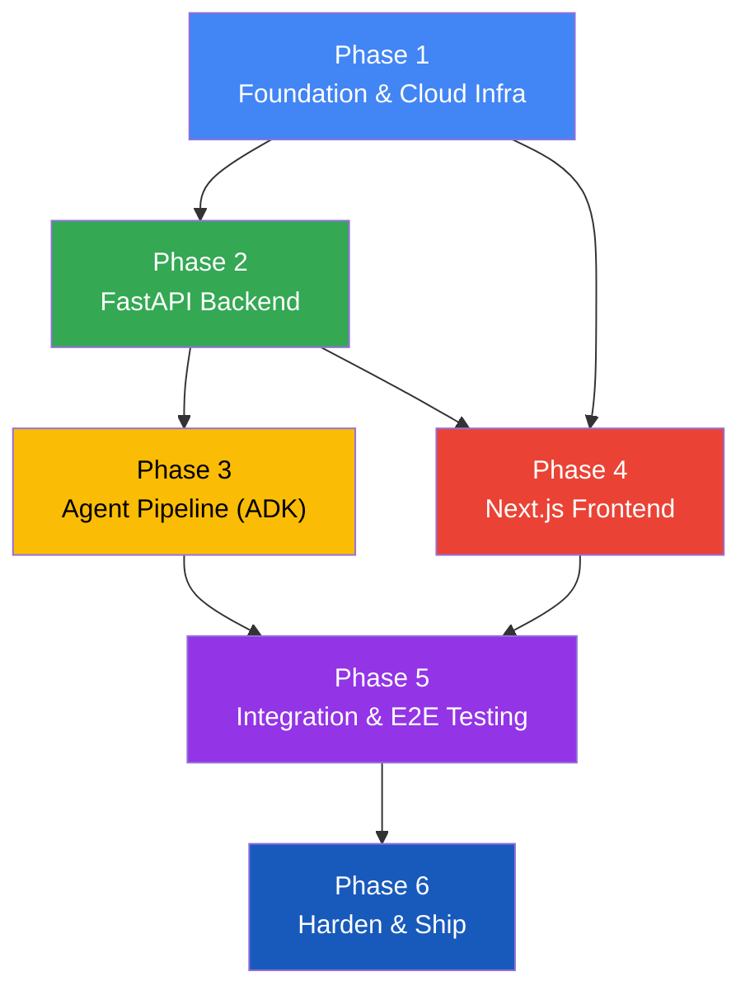

# Implementation Plan — Multi-Agent AI Code Reviewer

> **Version:** 1.0  
> **Last Updated:** 2026-08-18  
> **Status:** Draft  
> **Total Phases:** 6  
> **Estimated Timeline:** 10–14 weeks

---

## Phase Overview



---

## Phase 1 — Project Foundation & Cloud Infrastructure

> **Goal:** Stand up the GCP project, authentication, database, and storage — the bedrock every other phase depends on.  
> **Duration:** ~1.5 weeks

### 1.1 GCP Project Setup

| Task | Detail |
|---|---|
| Create GCP project | Enable billing; set project ID |
| Enable APIs | Cloud Run, Firestore, Cloud Storage, Secret Manager, Cloud Build, Cloud Logging |
| Configure IAM | Create service accounts: `backend-sa`, `frontend-sa` with least-privilege roles |
| Set up VPC | Create VPC network; configure serverless VPC connector for Cloud Run |

### 1.2 Firebase Authentication & App Check

| Task | Detail |
|---|---|
| Initialize Firebase project | Link to GCP project |
| Enable Auth providers | Email/password (minimum); optionally Google OAuth |
| Enable App Check | Configure reCAPTCHA Enterprise attestation provider |
| Generate Admin SDK key | Store in Secret Manager for backend token verification |

### 1.3 Firestore Enterprise

| Task | Detail |
|---|---|
| Provision Firestore | Enterprise mode, regional or multi-region |
| Create collections | `users`, `reviews`, `findings`, `rules` |
| Define indexes | Composite index on `reviews` (`userId` + `submittedAt` desc) |
| Write security rules | Per-user isolation: `request.auth.uid == resource.data.userId` |
| Seed test data | Insert sample user, review, and findings documents |

**Collection Schema Reference:**

```
users/{uid}
  ├── email: string
  ├── displayName: string
  └── createdAt: timestamp

reviews/{reviewId}
  ├── userId: string (FK → users)
  ├── language: string
  ├── codeSnippet: string
  ├── overallScore: number (1–10)
  ├── scoreBreakdown: map { security, performance, quality, testing, historical }
  ├── submittedAt: timestamp
  └── status: string ("processing" | "complete" | "error")

reviews/{reviewId}/findings/{findingId}
  ├── agentSource: string
  ├── category: string
  ├── severity: string ("critical" | "high" | "medium" | "low")
  ├── description: string
  ├── suggestedFix: string
  └── matchedRuleId: string (nullable, FK → rules)

rules/{ruleId}
  ├── type: string ("security" | "performance" | "formatting" | ...)
  └── description: string
```

### 1.4 Cloud Storage — Historical CSV

| Task | Detail |
|---|---|
| Create bucket | `gs://<project>-rules/` with uniform bucket-level access |
| Upload seed CSV | `historical_reviews.csv` with schema: `id, type, description` |
| Lock down access | Grant `backend-sa` `objectViewer` only |

**Seed CSV:**

```csv
id,type,description
1,formatting,Avoid single-character variable names — they hurt readability
2,performance,Cache repeated database lookups inside the request loop
3,security,Never interpolate raw user input directly into SQL queries
4,security,Always validate that the authenticated user owns the requested resource
5,performance,Add pagination for any endpoint that returns unbounded lists
```

### Phase 1 — Deliverables & Exit Criteria

- [ ] GCP project with all APIs enabled and IAM configured
- [ ] Firebase Auth working (register + login flow tested via Firebase console)
- [ ] Firestore provisioned with collections, indexes, and security rules
- [ ] Cloud Storage bucket created with seed CSV uploaded
- [ ] Secret Manager holds Firebase Admin SDK key

---

## Phase 2 — FastAPI Backend Service

> **Goal:** Build the backend API that handles authentication, code submission, language detection, CSV rule ingestion, and persistence.  
> **Duration:** ~2 weeks

### 2.1 Project Scaffold

```
backend/
├── app/
│   ├── main.py              # FastAPI app + lifespan (startup CSV ingestion)
│   ├── config.py            # Settings via Pydantic BaseSettings
│   ├── dependencies.py      # Shared deps (Firestore client, auth verifier)
│   ├── middleware/
│   │   └── auth.py          # Firebase ID token verification middleware
│   ├── routers/
│   │   ├── health.py        # GET /api/v1/health
│   │   └── reviews.py       # POST + GET /api/v1/reviews
│   ├── services/
│   │   ├── review_service.py    # Business logic: submit, retrieve, list
│   │   ├── language_detector.py # Programming language detection
│   │   └── csv_ingestion.py     # Parse CSV → Firestore rules
│   ├── agents/
│   │   └── pipeline.py      # Agent invocation orchestration (Phase 3)
│   └── models/
│       ├── review.py        # Pydantic models: ReviewRequest, ReviewResponse
│       └── finding.py       # Pydantic models: Finding, ScoreBreakdown
├── Dockerfile
├── requirements.txt
└── tests/
    ├── test_auth.py
    ├── test_reviews.py
    └── test_csv_ingestion.py
```

### 2.2 Implementation Tasks

| # | Task | Description | Dependencies |
|---|---|---|---|
| 2.2.1 | **FastAPI scaffold** | Create `main.py` with lifespan, CORS, and router registration | Phase 1 complete |
| 2.2.2 | **Config & secrets** | Load Firebase project ID, Firestore credentials, GCS bucket from env / Secret Manager | 2.2.1 |
| 2.2.3 | **Auth middleware** | Verify Firebase ID tokens using `firebase-admin` SDK; extract UID; reject invalid tokens with 401 | 2.2.2 |
| 2.2.4 | **Health endpoint** | `GET /api/v1/health` — returns 200 + Firestore connectivity check | 2.2.1 |
| 2.2.5 | **CSV ingestion** | On startup: download CSV from GCS, parse, upsert into `rules` collection | 2.2.2 |
| 2.2.6 | **Language detection** | Heuristic + library-based detection (e.g., `pygments` lexer guessing) of submitted code | 2.2.1 |
| 2.2.7 | **Submit review endpoint** | `POST /api/v1/reviews` — validate input, detect language, create `review` doc (status: `processing`), trigger agent pipeline (stub in Phase 2, wired in Phase 3) | 2.2.3, 2.2.6 |
| 2.2.8 | **Get review endpoint** | `GET /api/v1/reviews/{id}` — return review + findings; enforce user ownership | 2.2.3 |
| 2.2.9 | **List reviews endpoint** | `GET /api/v1/reviews` — paginated list filtered by authenticated user's UID | 2.2.3 |
| 2.2.10 | **Unit tests** | Test auth middleware, CSV parsing, language detection, endpoint contracts | 2.2.3–2.2.9 |
| 2.2.11 | **Containerize & deploy** | Dockerfile → Cloud Build → Cloud Run with VPC connector and service account | 2.2.10 |

### 2.3 API Contract

**`POST /api/v1/reviews`**

```json
// Request
{
  "code": "def get_orders(customer_id):\n  ...",
  "title": "Add customer order-history API",
  "description": "Optional PR description"
}

// Response (202 Accepted)
{
  "reviewId": "abc-123",
  "status": "processing",
  "language": "python",
  "submittedAt": "2026-08-25T10:00:00Z"
}
```

**`GET /api/v1/reviews/{id}`**

```json
// Response (200 OK)
{
  "reviewId": "abc-123",
  "status": "complete",
  "language": "python",
  "overallScore": 4,
  "scoreBreakdown": {
    "security": 2,
    "performance": 4,
    "codeQuality": 5,
    "testCoverage": 4,
    "historical": 5
  },
  "findings": [
    {
      "id": "f-001",
      "agentSource": "security",
      "category": "Blocking Issue",
      "severity": "critical",
      "description": "The API endpoint must verify that the authenticated user is authorized...",
      "suggestedFix": "Add ownership check before returning data",
      "matchedRuleId": null
    }
  ],
  "submittedAt": "2026-08-25T10:00:00Z"
}
```

### Phase 2 — Deliverables & Exit Criteria

- [ ] FastAPI service running on Cloud Run with authenticated endpoints
- [ ] CSV rules ingested into Firestore on startup
- [ ] Language detection returns correct language for Python, JavaScript, Java, Go, TypeScript
- [ ] All CRUD endpoints pass integration tests
- [ ] Postman / curl smoke test confirms auth rejection (401) and successful submission (202)

---

## Phase 3 — Multi-Agent Pipeline (ADK v1.0)

> **Goal:** Build, test, and integrate all seven AI agents on the Gemini Enterprise Agent Platform.  
> **Duration:** ~3 weeks (agents developed in parallel)

### 3.1 ADK Setup & Orchestrator

| Task | Detail |
|---|---|
| Install ADK v1.0 | Add `google-adk` to requirements; configure agent project |
| Define agent configs | YAML/JSON agent definitions for all 7 agents |
| Implement Orchestrator | Reads submission, detects language, fans out to 5 specialists in parallel, collects results, passes to Review Agent |
| Wire into FastAPI | `pipeline.py` invokes Orchestrator when `POST /api/v1/reviews` is called |

**Orchestrator Flow:**



### 3.2 Specialist Agent Implementations

Each agent is developed independently and tested in isolation before integration.

#### ② Code Quality Agent

| Aspect | Detail |
|---|---|
| **System Prompt Focus** | Structure, readability, naming, separation of concerns, DRY |
| **Input** | Code diff, detected language, project coding guidelines (if provided) |
| **Output Schema** | `{ findings: [{ category, severity, description, suggestedFix }] }` |
| **Key Behaviors** | Detect monolithic functions, unclear naming, duplicated logic, missing abstractions |

#### ③ Security Agent

| Aspect | Detail |
|---|---|
| **System Prompt Focus** | OWASP Top 10, auth/authz gaps, injection, data exposure, secret leakage |
| **Input** | Code diff, auth logic, API routes, env config |
| **Output Schema** | `{ findings: [{ category, severity, description, suggestedFix }] }` |
| **Key Behaviors** | Flag missing auth checks, SQL injection, PII logging, insecure error messages |

#### ④ Performance Agent

| Aspect | Detail |
|---|---|
| **System Prompt Focus** | DB efficiency, N+1 queries, missing pagination, caching, algorithmic complexity |
| **Input** | Code diff (especially DB queries), expected data volume |
| **Output Schema** | `{ findings: [{ category, severity, description, suggestedFix }] }` |
| **Key Behaviors** | Detect unbounded queries, loops with DB calls, missing indexes, no caching |

#### ⑤ Test & Edge-Case Agent

| Aspect | Detail |
|---|---|
| **System Prompt Focus** | Test coverage, missing scenarios, assertion quality, happy/unhappy paths |
| **Input** | Code diff, test files, API contract |
| **Output Schema** | `{ findings: [{ category, severity, description, suggestedFix }] }` |
| **Key Behaviors** | Identify untested code paths, missing error/auth/edge-case tests, weak assertions |

#### ⑥ Historical Learning Agent

| Aspect | Detail |
|---|---|
| **System Prompt Focus** | Match current code against historical team rules; surface past patterns |
| **Input** | Code diff + historical rules fetched from Firestore (filtered by `type`) |
| **Output Schema** | `{ findings: [{ category, severity, description, suggestedFix, matchedRuleId }] }` |
| **Key Behaviors** | Query Firestore for rules matching review type; inject matched rules into prompt; cite rule ID in findings |

**Historical Learning Agent — Data Flow:**



#### ⑦ Review Agent

| Aspect | Detail |
|---|---|
| **System Prompt Focus** | Validate, deduplicate, prioritize, score, and format the final report |
| **Input** | Combined findings from all 5 specialists |
| **Output Schema** | `{ overallScore, scoreBreakdown, findings (sorted by severity), summary }` |
| **Key Behaviors** | Merge duplicates, verify findings are grounded, assign severity, compute weighted score, separate blocking vs. optional |

### 3.3 Agent Testing Strategy

| Test Type | Scope | Method |
|---|---|---|
| **Unit** | Individual agent with canned input | Feed known code snippets; assert expected finding categories and severity |
| **Integration** | Full pipeline (Orchestrator → Specialists → Review) | Submit end-to-end code samples; validate report structure and score range |
| **Regression** | Known vulnerability patterns | Maintain a suite of code samples with expected findings; run on every agent change |
| **Scoring Calibration** | Review Agent score consistency | Submit code of known quality (excellent, poor, critical); verify score bands |

### Phase 3 — Deliverables & Exit Criteria

- [ ] All 7 agents implemented and individually tested
- [ ] Orchestrator successfully fans out and collects results in parallel
- [ ] Review Agent produces a deduplicated, scored final report
- [ ] Historical Learning Agent correctly queries and cites Firestore rules
- [ ] End-to-end pipeline test: submit Python + JavaScript samples → receive valid reports
- [ ] Agent pipeline wired into FastAPI `POST /api/v1/reviews`

---

## Phase 4 — Next.js 16 Frontend

> **Goal:** Build the user-facing application: authentication, code submission, review display, and history dashboard.  
> **Duration:** ~2 weeks (can run in parallel with Phase 3)

### 4.1 Project Structure

```
frontend/
├── app/
│   ├── layout.tsx            # Root layout with auth provider
│   ├── page.tsx              # Landing / redirect to /submit
│   ├── (auth)/
│   │   ├── login/page.tsx
│   │   └── register/page.tsx
│   ├── submit/page.tsx       # Code submission form
│   ├── reviews/
│   │   └── [id]/page.tsx     # Single review report
│   └── history/page.tsx      # Review history + growth trend
├── components/
│   ├── CodeEditor.tsx        # Syntax-highlighted code input
│   ├── ScoreGauge.tsx        # Visual 1–10 score display
│   ├── FindingsTable.tsx     # Categorized findings list
│   ├── ScoreBreakdown.tsx    # Radar/bar chart of dimension scores
│   └── QualityTrend.tsx      # Line chart of scores over time
├── lib/
│   ├── firebase.ts           # Firebase client init
│   ├── auth.ts               # Auth context + hooks
│   └── api.ts                # API client (fetch wrapper with auth header)
├── Dockerfile
├── next.config.ts
└── package.json
```

### 4.2 Implementation Tasks

| # | Task | Description | Dependencies |
|---|---|---|---|
| 4.2.1 | **Next.js scaffold** | `npx create-next-app` with TypeScript, App Router | — |
| 4.2.2 | **Firebase client setup** | Initialize Firebase SDK; configure App Check | Phase 1 (Firebase project) |
| 4.2.3 | **Auth pages** | Login + Registration forms; redirect on success; error handling | 4.2.2 |
| 4.2.4 | **Auth context & guards** | React context for auth state; route protection for authenticated pages | 4.2.3 |
| 4.2.5 | **API client** | Fetch wrapper that auto-attaches Firebase ID token to `Authorization: Bearer` header | 4.2.4 |
| 4.2.6 | **Code submission page** | Text area / code editor, optional title & description fields, language auto-detect preview, submit button | 4.2.5 |
| 4.2.7 | **Review report page** | Display overall score (visual gauge), score breakdown chart, findings table sorted by severity, suggested fixes | 4.2.5 |
| 4.2.8 | **Review history page** | Paginated list of past reviews; quality-score trend chart; click-through to individual reports | 4.2.5 |
| 4.2.9 | **Responsive design** | Mobile-friendly layouts; dark mode support | 4.2.6–4.2.8 |
| 4.2.10 | **Containerize & deploy** | Dockerfile → Cloud Build → Cloud Run | 4.2.9 |

### 4.3 Key UI Components



### Phase 4 — Deliverables & Exit Criteria

- [ ] Users can register, login, and logout
- [ ] Authenticated users can submit code and see a "processing" state
- [ ] Completed reviews display score gauge, breakdown chart, and findings table
- [ ] History page shows paginated past reviews with quality-score trend line
- [ ] App is responsive and works on mobile viewports
- [ ] Frontend deployed on Cloud Run

---

## Phase 5 — Integration & End-to-End Testing

> **Goal:** Connect all layers (frontend ↔ backend ↔ agents ↔ database) and validate the full user journey.  
> **Duration:** ~1.5 weeks

### 5.1 Integration Tasks

| # | Task | Description |
|---|---|---|
| 5.1.1 | **Frontend ↔ Backend** | Verify auth token flow, submission, polling/webhook for completion, review retrieval |
| 5.1.2 | **Backend ↔ Agent Pipeline** | Confirm Orchestrator invocation, parallel fan-out, result persistence to Firestore |
| 5.1.3 | **Historical Learning flow** | Submit code that matches CSV rules; verify findings cite `matchedRuleId` |
| 5.1.4 | **Multi-language validation** | Submit samples in Python, JavaScript, TypeScript, Java, Go; verify correct language detection and language-appropriate findings |
| 5.1.5 | **Error handling** | Test agent timeout, invalid code input, expired auth tokens, Firestore unavailability |
| 5.1.6 | **Score consistency** | Submit calibrated samples (excellent, fair, critical); verify scores land in expected bands |

### 5.2 End-to-End Test Scenarios

| # | Scenario | Expected Outcome |
|---|---|---|
| E2E-1 | Register → Login → Submit Python code → View report | Report with score, 5 finding categories, score breakdown |
| E2E-2 | Submit code with SQL injection pattern | Security Agent flags critical finding; score ≤ 4 |
| E2E-3 | Submit code matching historical CSV rule #3 | Historical Learning Agent cites rule #3 in findings |
| E2E-4 | Submit well-written code with tests | Score ≥ 7; no critical or high findings |
| E2E-5 | Submit JavaScript code | Language detected as JavaScript; JS-specific conventions in findings |
| E2E-6 | Unauthenticated request to `/api/v1/reviews` | 401 Unauthorized |
| E2E-7 | User A tries to access User B's review | 403 Forbidden |
| E2E-8 | View history after 5+ submissions | Paginated list; quality-score trend chart renders |

### 5.3 Test Execution Flow



### Phase 5 — Deliverables & Exit Criteria

- [ ] All E2E test scenarios pass
- [ ] Multi-language detection confirmed for ≥ 5 languages
- [ ] Historical rule matching works end-to-end
- [ ] Error paths handled gracefully (timeouts, auth failures, invalid input)
- [ ] Score calibration validated against known-quality code samples

---

## Phase 6 — Hardening, Observability & Launch

> **Goal:** Production-harden the system with security, monitoring, load testing, and documentation.  
> **Duration:** ~1.5 weeks

### 6.1 Security Hardening

| Task | Detail |
|---|---|
| Penetration review | Verify OWASP Top 10 mitigations on API endpoints |
| Input sanitization | Validate & size-limit code submissions (max payload, no binary) |
| Rate limiting | Cloud Armor or API-level throttling per user |
| CORS lockdown | Restrict allowed origins to frontend domain only |
| Secret rotation | Verify all secrets in Secret Manager; no hardcoded credentials |
| Dependency audit | Run `pip audit` and `npm audit`; patch vulnerabilities |

### 6.2 Observability & Monitoring

| Layer | Tool | What to Monitor |
|---|---|---|
| **Logging** | Cloud Logging | Structured JSON logs from FastAPI; agent execution traces |
| **Tracing** | Cloud Trace | End-to-end request latency; agent fan-out timing |
| **Metrics** | Cloud Monitoring | Request rate, error rate, p50/p95 latency, Firestore read/write ops |
| **Alerting** | Cloud Monitoring Alerts | Error rate > 5%, latency p95 > 30s, agent pipeline failures |
| **Dashboard** | Cloud Monitoring Dashboard | Real-time system health; review throughput; score distribution |

### 6.3 Load Testing

| Test | Target | Success Criteria |
|---|---|---|
| Concurrent submissions | 50 simultaneous review submissions | All return within 60s; no 5xx errors |
| Sustained load | 10 reviews/minute for 30 minutes | Stable latency; Cloud Run scales appropriately |
| Cold start | First request after scale-to-zero | Response within 15s (including CSV ingestion) |

### 6.4 Documentation & Handoff

| Document | Contents |
|---|---|
| **README.md** | Project overview, quick start, local dev setup |
| **API Reference** | OpenAPI/Swagger auto-generated from FastAPI |
| **Agent Prompt Guide** | System prompts, tuning guidelines, scoring calibration |
| **Runbook** | Deployment steps, rollback procedures, incident response |
| **CSV Rule Management** | How to add/update historical rules; re-ingestion process |

### Phase 6 — Deliverables & Exit Criteria

- [ ] Security checklist passed (OWASP, dependency audit, input validation)
- [ ] Monitoring dashboard live with alerting configured
- [ ] Load tests pass with defined success criteria
- [ ] All documentation complete and reviewed
- [ ] Production deployment validated with smoke tests

---

## Phase Dependency Map



> **Note:** Phases 3 (Agents) and 4 (Frontend) can run **in parallel** once Phase 2 is complete, significantly compressing the timeline.

---

## Risk Register

| Risk | Impact | Likelihood | Mitigation |
|---|---|---|---|
| Agent latency exceeds user expectations | High | Medium | Set timeout limits; show progressive loading; consider async polling |
| Gemini 3.6 Flash rate limits under load | High | Low | Implement retry with backoff; request quota increase; queue submissions |
| CSV rule ingestion fails on startup | Medium | Low | Cache last-known rules in Firestore; alert on ingestion failure |
| Multi-language detection inaccuracy | Medium | Medium | Combine heuristic + library detection; allow manual language override |
| Scoring inconsistency across runs | Medium | Medium | Pin model temperature; maintain calibration test suite; version prompts |
| Firebase Auth token expiry mid-review | Low | Low | Frontend refreshes token before submission; backend rejects gracefully |

---

## Success Metrics

| Metric | Target |
|---|---|
| End-to-end review latency (p95) | < 30 seconds |
| Language detection accuracy | ≥ 95% for top 10 languages |
| Score calibration accuracy | Scores within ±1 of expert human rating on test suite |
| System availability | ≥ 99.5% uptime |
| User satisfaction | Review feedback rated "useful" ≥ 80% of the time |
